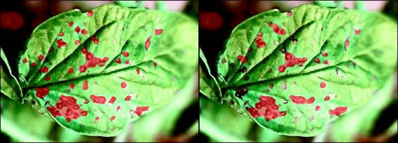
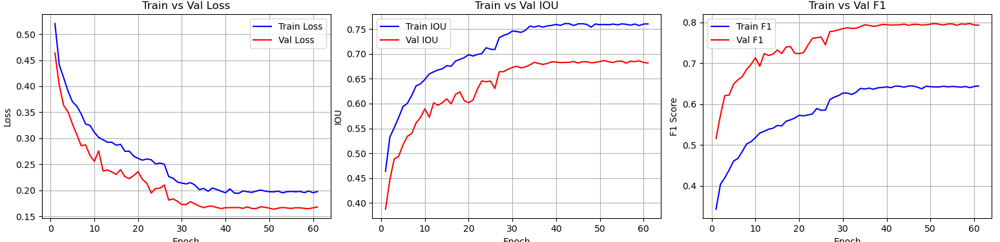

# Plant leaf detection using segmentation using U-Net architecture
### This project deals with segmenting the part of the plant which has disease accurately.

### 1. Inference

Left - Ground Truth, Right - Precdition             |  
:-------------------------:|
  |  

### 2. Metrics
Loss/IOU/F-1 Score            | 
:-------------------------:|
 |
